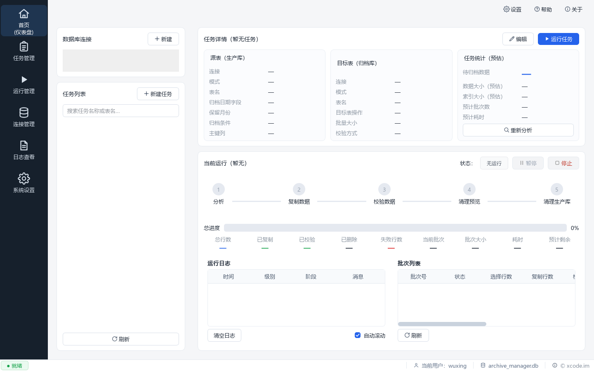

<p align="center">
  
</p>

<h1 align="center">Oracle Archive Manager</h1>

<p align="center">
  面向 Oracle 数据库的大表历史数据归档与安全清理工具（Oracle 11g+）<br />
  <b>分析 → 复制 → 校验 → 人工确认 → 清理</b>，全链路审计留痕
</p>

<p align="center">
  
  
  
  
  
</p>

---

## 项目简介

长期运行的 Oracle 生产系统中，大表会持续累积历史数据，导致表和索引体积膨胀、查询与维护成本上升、备份时间变长；但业务上既不敢直接删除，历史数据又需要保留可查。

**Oracle Archive Manager** 解决的就是这个问题：把满足归档条件的数据从生产 Oracle 安全迁移到独立归档 Oracle，**确认数据完整后**，再由人工显式清理生产库。

它是一个 Python C/S 桌面程序（PySide6 GUI），控制数据保存在本地 SQLite，默认低侵入：

- **不修改业务表结构、不创建触发器、不依赖 DB Link**
- 生产库默认只读账号即可运行；清理（Purge）可单独使用具备 DELETE 权限的账号

## 核心原则

> **复制是自动的，清理必须经显式确认。**
> （Copy is automatic. Destruction is explicit.）

1. 复制可以自动执行；
2. 删除生产数据必须经过验证；
3. 删除必须由用户显式触发、二次确认；
4. 任一批次验证失败，生产库该批次不得删除；
5. 程序崩溃后可判断数据处于 COPY / VERIFIED / PURGED 哪个阶段；
6. 所有归档边界在 RUN 创建时冻结，恢复任务不会重新计算；
7. 归档工具不修改业务表结构；
8. 全部操作留有审计记录。

## 主要功能

| 功能 | 说明 |
|---|---|
| 连接管理 | 生产库 / 归档库双连接，测试连接、获取版本与 Schema，密码本地安全保存（keyring） |
| 归档分析 | 按日期字段 + 保留月份，预估总行数、待归档行数、表/索引大小与归档范围 |
| 分批归档 | 固定 Batch Size 分批复制，逐批提交、逐批校验，标记验证状态 |
| 安全清理 | Copy + Verify 完成后由用户显式触发 Purge，展示待删数量与条件、二次确认、分批提交、写入审计 |
| 断点续跑 | 程序异常退出 / 网络中断 / Oracle 异常后可恢复：识别未完成 RUN 与 Batch，不重复删除、不重复处理 |
| 定时调度 | 任务可配置计划，支持定时自动归档 |
| 运行报表 | 运行历史、批次明细、日志查看与导出 |
| 自动更新 | 启动时检查 GitHub 最新版本，发现新版后一键下载安装（OTA） |

## 下载与安装

前往 [Releases](https://github.com/ayumilove/OracleArchiveManager/releases) 下载最新的 Windows 单文件可执行程序（Nuitka 编译），解压即可运行，无需安装 Python 环境。

使用前提：

- Windows 10/11；
- 可访问生产与归档 Oracle 数据库（Oracle 11g 及以上，Thick 模式，需 Oracle Instant Client）。

## 从源码运行

需要 Python 3.12+，推荐使用 [uv](https://docs.astral.sh/uv/)：

```bash
# 安装依赖
uv sync

# 启动程序
uv run oracle-archive-manager

# 运行单元测试
uv run pytest
```

## 技术栈

- **Python 3.12+ / PySide6**：桌面 GUI
- **python-oracledb**：Oracle 数据库访问（Thick 模式，兼容 Oracle 11g）
- **SQLite**：本地控制库（任务、连接、运行记录、审计）
- **pydantic / loguru / keyring**：数据模型、日志、凭据安全存储
- **Nuitka**：发布打包
- **pytest**：单元测试

## 文档

设计与开发文档统一存放在 [`docs/`](docs/)：

| 文件 | 内容 |
|---|---|
| [`01_PRODUCT_REQUIREMENTS.md`](docs/01_PRODUCT_REQUIREMENTS.md) | 产品需求与范围 |
| [`02_ARCHITECTURE_DESIGN.md`](docs/02_ARCHITECTURE_DESIGN.md) | 总体架构设计 |
| [`03_DATA_MODEL.md`](docs/03_DATA_MODEL.md) | SQLite 控制库数据模型 |
| [`04_ARCHIVE_WORKFLOW.md`](docs/04_ARCHIVE_WORKFLOW.md) | 归档、验证、清理状态机 |
| [`05_ORACLE_STRATEGY.md`](docs/05_ORACLE_STRATEGY.md) | Oracle 11g 数据访问与性能策略 |
| [`06_GUI_DESIGN.md`](docs/06_GUI_DESIGN.md) | PySide6 GUI 页面与交互设计 |
| [`07_SECURITY_SAFETY.md`](docs/07_SECURITY_SAFETY.md) | 数据安全、权限与防误操作 |
| [`08_DEVELOPMENT_PLAN.md`](docs/08_DEVELOPMENT_PLAN.md) | 分阶段开发计划 |
| [`09_TODO.md`](docs/09_TODO.md) | 可执行 Todo List |
| [`10_TEST_PLAN.md`](docs/10_TEST_PLAN.md) | 测试与验收方案 |
| [`11_PROJECT_STRUCTURE.md`](docs/11_PROJECT_STRUCTURE.md) | Python 工程目录和模块职责 |
| [`12_RELEASE_DEPLOYMENT.md`](docs/12_RELEASE_DEPLOYMENT.md) | 打包、部署、升级与配置 |
| [`13_OPEN_SOURCE_PLAN.md`](docs/13_OPEN_SOURCE_PLAN.md) | 后续开源策略建议 |
| [`14_DECISIONS.md`](docs/14_DECISIONS.md) | 当前已经确定的技术决策 |

## CI/CD

- `push` / PR：GitHub Actions 自动运行单元测试（[`ci.yml`](.github/workflows/ci.yml)）；
- `v*.*.*` 标签：自动 Nuitka 编译 Windows 单文件 exe 并发布 GitHub Release（[`release.yml`](.github/workflows/release.yml)）。

## 路线图（V1 明确不做）

- MySQL / PostgreSQL / SQL Server 支持
- Oracle CDC、实时同步
- DB Link、Data Pump 自动编排
- 全自动无人审批的 Purge
- Web/B/S、多租户、分布式 Worker

## 问题反馈

使用中遇到问题，欢迎提交 [Issue](https://github.com/ayumilove/OracleArchiveManager/issues)。

---

<p align="center">© 2026 xcode.im · Oracle Archive Manager</p>
